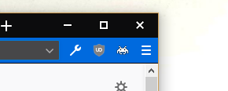
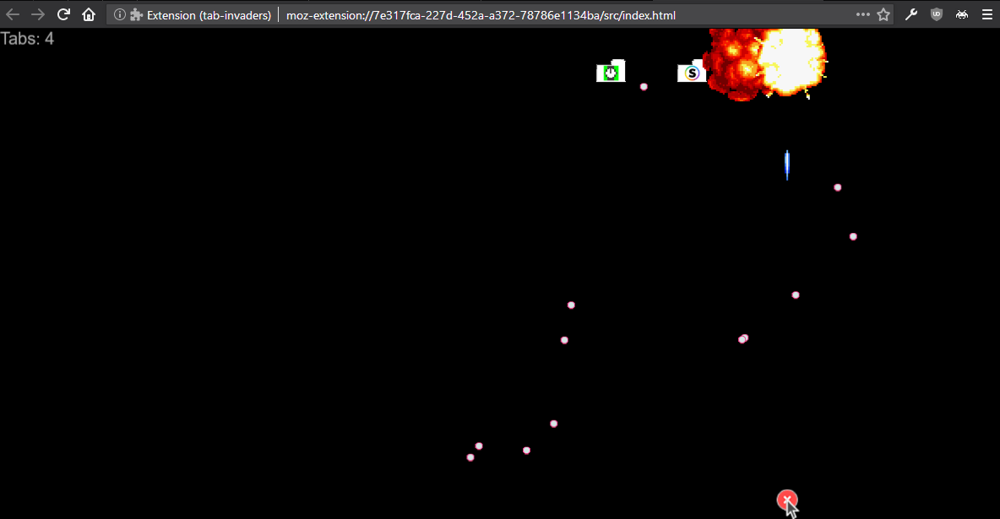

# tab-invaders

  
Also supports Google Chrome

Tabaholics beware, a new enemy is in town. Your tab collections are cowering in fear and sending their best fighters to protect them against the oncoming attack. But alas, their aim is that of storm-troopers and you are a master pilot.

This webextension is a game of space-invaders, modified to kill tabs instead of aliens. As each tab is killed, it will close in your browser.

### Screenshots
  
  
  

### Building
1. `yarn`
2. `yarn build`
3. The extension is then in the `build/extension` directory

### License and Credits
[MIT License](./LICENSE)

To create the game of space invaders, rather than re-invent the wheel this codebase uses an almost-complete-rewrite of [https://github.com/StrykerKKD/SpaceInvaders](https://github.com/StrykerKKD/SpaceInvaders).
